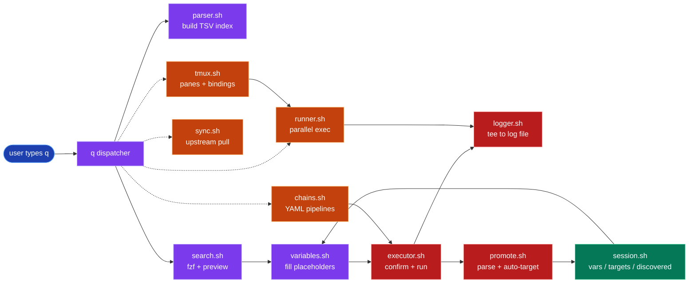
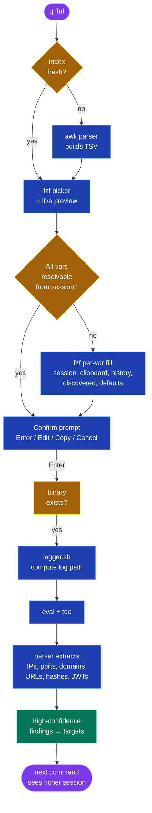
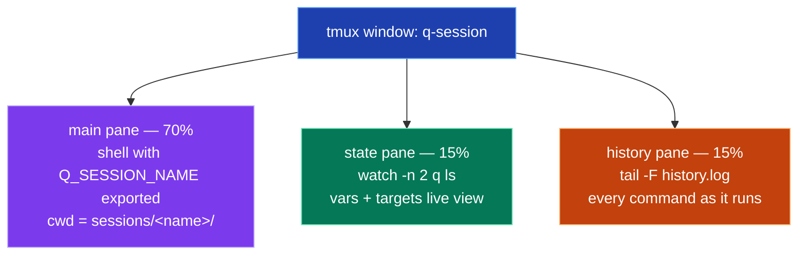

# q

Fast, keyboard-driven command launcher for pentesters. Searches a local cheatsheet index with `fzf`, fills in `{{placeholders}}` from session state, executes, parses the output, and promotes findings back into the session for the next command.

```
q> nmap full     enum     Aggressive scan with default scripts
                          $ nmap -sC -sV -A -T4 {{TARGET}}
```

---

## Features

- **Sub-millisecond fuzzy search** over ~130 curated cheatsheets (recon, web, AD, post-exploit, passwords, system, network, vulnerability, wireless).
- **Session-aware variable fill** — `{{TARGET}}`, `{{RHOST}}`, `{{WORDLIST}}` resolve from session state, clipboard, target list, prior values, or discovered data. Path-typed vars get filesystem completion. `{{LHOST}}` auto-detects from `tun0`/`eth0`.
- **Output capture and auto-promote** — every command's stdout is parsed for IPs, domains, URLs, open ports, services, SMB shares, NTLM/Kerberos hashes, JWTs, LDAP DNs, and HTTP titles. High-confidence findings become targets automatically.
- **Per-target timestamped logs** — every run is captured to `sessions/<name>/runs/<target>/<tool>-<ts>.log`. List, show, prune.
- **YAML command chains** — `q chain run NAME` walks declared steps with `{{var}}` substitution, conditional gates, `continue_on_error`, and `--dry-run`.
- **Parallel multi-target execution** — `q run -j 8 'curl -s {{URL}}/robots.txt'` fans out across every session target.
- **External cheatsheet sync** — pull upstream pentest repos (e.g. PayloadsAllTheThings) into `cheatsheets/external/<name>/`. Same parser, same index.
- **Multi-session workflow** — switch contexts with `q session use <name>`. Targets, vars, history, discovered data are scoped per session.
- **Tmux integration** — one tmux session per `q` session with pre-built 3-pane layout, prefix bindings for common ops, and `q run --tmux` to spawn one live pane per target. Detach and reattach without losing state.
- **MRU bias** — recently used commands float to the top of the search list.

---

## Architecture



---

## Install

```bash
git clone https://github.com/0xDTC/0xq.git
cd 0xq
./install.sh
```

The installer registers a `q` shim on your `$PATH` and wires up the `Ctrl+Q` shell widget for inline mode.

### Runtime dependencies (auto-installed on Kali/Debian)

| Package        | Purpose                             |
| -------------- | ----------------------------------- |
| `fzf`          | Interactive search and pickers      |
| `gawk`         | Index parser, variable substitution |
| `grep`, `sed`  | Cheatsheet scan, ANSI handling      |

### Optional but recommended

| Package    | Why                                    |
| ---------- | -------------------------------------- |
| `bat`      | Syntax-highlighted command preview     |
| `xclip`    | Clipboard read/write for vars and copy |
| `yq`       | YAML parsing for `q chain`             |
| `parallel` | Alternative parallel backend           |
| `tmux`     | `q tmux` workflow and `q run --tmux`   |

`q` calls `apt-get install` automatically for missing hard deps the first time it runs.

---

## Quickstart

```bash
# Create a session and add a target
q session create htb_lab
q t 10.10.11.42

# Search and run interactively (fzf)
q nmap version

# Set a variable manually
q set WORDLIST /usr/share/seclists/Discovery/Web-Content/common.txt

# After the scan finishes, discoveries auto-promote.
# Inspect the session state:
q ls

# Replay output for a target
q logs show nmap 10.10.11.42

# Run a chain
q chain run example_recon
```

---

## Command reference

| Command                                  | What it does                                              |
| ---------------------------------------- | --------------------------------------------------------- |
| `q [query]`                              | Interactive search → fill → execute                       |
| `q --inline [query]`                     | Print the filled command (used by the `Ctrl+Q` widget)    |
| `q set VAR VALUE`                        | Set a session variable                                    |
| `q get VAR`                              | Read a session variable                                   |
| `q session create / use / list / purge`  | Manage named sessions                                     |
| `q t IP [IP...]`                         | Add one or more targets to the session                    |
| `q add VALUE`                            | Add a target with explicit classification                 |
| `q rm [VALUE]`                           | Remove a target (fzf picker if no arg)                    |
| `q targets` / `q ls`                     | List targets / list vars + targets                        |
| `q c`                                    | Clear targets in the active session                       |
| `q history`                              | Show timestamped command history                          |
| `q promote`                              | Promote discoveries → targets                             |
| `q chain list / show NAME / run NAME`    | Browse and execute YAML chains (`--dry-run` supported)    |
| `q run [-j N] CMD`                       | Fan a command template across every target in parallel   |
| `q run show TARGET`                      | Print last output for a target                            |
| `q run clean`                            | Wipe parallel-run output dir                              |
| `q logs ls [--tool T] [--target V]`      | List per-target log files newest-first                    |
| `q logs show TOOL [TARGET]`              | Cat most recent matching log                              |
| `q logs prune [--older-than N] [--keep N]` | Trim old logs                                           |
| `q sync list / run [NAME] / add / disable / remove` | Sync upstream cheatsheet repos                 |
| `q tmux start / attach / kill / list / send / help` | tmux session tied to active q session         |
| `q run --tmux CMD`                       | Parallel run with one tmux pane per target                |
| `q rebuild`                              | Force-rebuild the cheatsheet index                        |
| `q --version`, `q --help`                | Print version / help                                      |

---

## Run-time flow



---

## Cheatsheet format

Each cheatsheet is a markdown file under `cheatsheets/<category>/<tool>.md`. The parser indexes every H2 with a fenced `bash` block.

````markdown
<!-- tags: smb,enum -->
# crackmapexec

## Enumerate shares
<!-- meta: risk=low | phase=enum | tags=smb -->
Anonymous share listing on the SMB target.

```bash
crackmapexec smb {{TARGET}} -u '' -p '' --shares
```

## Password spray
<!-- meta: risk=medium | phase=exploit | tags=auth -->
Spray one password across a user list.

```bash
crackmapexec smb {{TARGET}} -u {{USERFILE:wordlist}} -p {{PASSWORD}}
```
````

### Variable placeholders

```
{{NAME}}                 plain string
{{NAME:type}}            typed (drives candidate list)
{{NAME:type:default}}    typed with default
```

Supported types: `str`, `ip`, `url`, `domain`, `port`, `file`, `wordlist`, `dir`, `iface`. The type drives which candidates appear in the per-variable fzf picker (session value, clipboard, targets of compatible type, discovered data, history, wordlist library, network interfaces, common ports).

### Meta directives

| Directive                                    | Effect                                       |
| -------------------------------------------- | -------------------------------------------- |
| `<!-- tags: a,b,c -->` (file-level)          | Tags applied to every entry in the file      |
| `<!-- meta: risk=R | phase=P | tags=t1,t2 -->` (entry-level) | Per-entry risk badge, phase tag, extra tags |

---

## Sessions and targets

```
~/.local/share/q/
└── sessions/
    └── htb_lab/
        ├── vars                  KEY=VALUE
        ├── targets               type:value (one per line, MRU first)
        ├── history.log           timestamp\tcommand
        ├── discovered/           ips, ports, domains, urls, services,
        │                         users, passwords, shares, hashes,
        │                         jwts, ldap_dns, titles, port_lists
        └── runs/
            ├── 10.10.11.42/      <tool>-<YYYYMMDD-HHMMSS>.log
            ├── example.htb/      ...
            ├── _unscoped/        commands with no inferable target
            └── parallel/         <target>-<ts>.out  (from q run)
```

Switch sessions with `q session use <name>`. Each session is fully isolated.

---

## Output capture and promotion

After every command, the captured output is parsed for the patterns below and stored under `sessions/<name>/discovered/`. High-confidence types (`ips`, `domains`, `urls`) are then promoted to the session's target list so the next command's `{{TARGET}}` / `{{URL}}` picker sees them at the top.

| Discovery type | Source patterns                                                     |
| -------------- | ------------------------------------------------------------------- |
| `ips`          | IPv4 addresses (filters 0.0.0.0 / 127.0.0.1 / 255.255.255.255)      |
| `ports`        | `\d+/(tcp\|udp)`                                                    |
| `services`     | `^\d+/tcp\s+open\s+\S+` (nmap)                                      |
| `domains`      | FQDN-shaped tokens, file-extension blocklist applied                |
| `urls`         | `https?://...`                                                      |
| `users`        | `crackmapexec` / `nxc` domain-prefixed usernames                    |
| `passwords`    | Cracked-credential lines from `john`, `hashcat`, `hydra`            |
| `shares`       | SMB share lines from `crackmapexec` / `smbclient -L`                |
| `hashes`       | NTLM `$NT$`, `$krb5*` Asreproast, `$krb5tgs$` Kerberoast           |
| `jwts`         | `ey<header>.ey<payload>.<sig>` (length > 100 to avoid false hits)   |
| `ldap_dns`     | Chained `DC=...,DC=...` tokens                                      |
| `titles`       | `<title>...</title>` (curl, whatweb)                                |

`q promote` runs the same bridge manually if you want to re-promote without re-running a command.

---

## YAML chains

A chain is a list of named steps executed in declared order, sharing one session.

```yaml
name: example_recon
description: Quick recon flow against a target host
vars:
  PORTS: "1-1000"

steps:
  - title: Initial port scan
    command: nmap -sV -p {{PORTS}} {{TARGET}}
    continue_on_error: false

  - title: HTTP probe (if port 80 open)
    command: curl -s -o /dev/null -w '%{http_code}\n' http://{{TARGET}}
    when: PORT_80
    continue_on_error: true

  - title: Directory brute force
    command: ffuf -w {{WORDLIST}} -u http://{{TARGET}}/FUZZ
    when: HTTP_OK
    continue_on_error: true
```

### Step lifecycle

```mermaid
flowchart LR
    S([step]) --> Gate{when:<br/>var set?}
    Gate -- no --> Skip[skip step<br/>increment skipped]
    Gate -- yes --> Resolve[fill &#123;&#123;vars&#125;&#125;<br/>from session]
    Resolve --> Resolved{all vars<br/>resolved?}
    Resolved -- no --> Warn[warn + skip]
    Resolved -- yes --> Mode{dry-run?}
    Mode -- yes --> Print[print filled cmd<br/>no exec / no log]
    Mode -- no --> Exec[history_log + eval]
    Exec --> Code{exit 0?}
    Code -- yes --> Next([next step])
    Code -- no --> Cont{continue_on_<br/>error?}
    Cont -- true --> Next
    Cont -- false --> Halt([abort chain])

    classDef step fill:#1e40af,stroke:#60a5fa,color:#fff
    classDef decision fill:#a16207,stroke:#fde047,color:#fff
    classDef good fill:#047857,stroke:#6ee7b7,color:#fff
    classDef bad fill:#b91c1c,stroke:#fca5a5,color:#fff
    classDef terminal fill:#7c3aed,stroke:#c4b5fd,color:#fff

    class S,Next,Halt terminal
    class Gate,Resolved,Mode,Code,Cont decision
    class Resolve,Exec,Print step
    class Skip,Warn bad
```



Chain files live in `chains/` (shipped) and `~/.local/share/q/chains/` (user). Chain `vars:` are merged into the session without overwriting existing values.

---

## Parallel runner

```bash
# Run the same command against every session target with 8 workers
q run -j 8 'curl -sI http://{{TARGET}}/'

# Type-aware: this skips ip targets and only runs against url targets
q run 'curl -s {{URL}}/robots.txt'

# Inspect the most recent output for a target
q run show 10.10.11.42

# Wipe the parallel-run output dir
q run clean --force
```

Placeholders honored per target: `{{TARGET}}`, `{{IP}}`, `{{URL}}`, `{{HOST}}`, `{{RHOST}}`, `{{DOMAIN}}`. Type incompatibility skips the target. Non-target placeholders fall through to session vars; unresolved → skip with a warning. Each invocation writes `sessions/<n>/runs/parallel/<target>-<ts>.out`.

---

## Tmux workflow

`q tmux start` creates a detached tmux session named for the active `q` session. The window has three panes: a work shell in the active `q` session, a live `q ls` viewer, and a tail of `history.log`. Detach with `prefix d`, come back later with `q tmux attach` — your work shell, target list, vars, and discovered data are all where you left them.



### Key bindings (prefix = `C-b`)

| Binding      | Action                                                                |
| ------------ | --------------------------------------------------------------------- |
| `prefix t`   | Prompt for a target value and run `q t <input>` in the main pane     |
| `prefix s`   | Prompt for `KEY=VALUE` and run `q set`                                |
| `prefix r`   | Open interactive `q` search in the main pane                          |
| `prefix p`   | Run `q promote`                                                       |
| `prefix L`   | `q logs ls` in a tmux popup (tmux >= 3.2) or new pane                 |
| `prefix Y`   | Capture current pane to the clipboard (xclip)                         |
| `prefix ?`   | Show this binding table in a popup                                    |

Bindings are sourced onto the running tmux server when `q tmux start` runs. Killing the session does not unbind them — they remain available until the tmux server restarts.

### Per-target live panes

```bash
q run --tmux 'nmap -sV {{TARGET}}'
```

Creates a new window named `run-<ts>` in the q tmux session with one tiled pane per target. Each pane:
- Substitutes per-target placeholders (`{{TARGET}}`, `{{IP}}`, `{{URL}}`, `{{HOST}}`, `{{DOMAIN}}`).
- Tees output to `sessions/<n>/runs/parallel/<target>-<ts>.out` so logs persist.
- Stays alive after the command exits so you can re-run / inspect.

Type incompatibility skips that target (e.g. a `{{URL}}`-only template skips IP targets). With <=1 target the command errors and points back to plain `q run`.

---

## Output logs

```bash
q logs ls                          # newest first
q logs ls --tool nmap              # filter by tool
q logs ls --target 10.10.11.42     # filter by target
q logs show nmap 10.10.11.42       # cat most recent
q logs prune --older-than 30       # delete logs older than 30 days
q logs prune --keep 5              # keep 5 most recent per tool+target
```

---

## Cheatsheet sync

```bash
q sync list                                 # show built-in and user sources
q sync add hacktricks_local file:///tmp/ht.git
q sync run                                  # pull everything enabled
q sync disable hacktricks                   # skip on sync-all
q sync remove hacktricks --force            # purge synced content
```

Built-in sources are curated repos. User overrides live in `~/.local/share/q/sync_sources` (one `name=url[#subpath]` per line). Synced content lands in `cheatsheets/external/<name>/` and is picked up by the next index rebuild.

---

## Configuration

`~/.config/q/config.sh` is sourced before each run. Anything left unset falls back to defaults.

```bash
# Confirmation prompt before exec (yes|no)
Q_CONFIRM_EXEC="yes"

# fzf appearance
Q_FZF_OPTS="--height=80% --border --reverse --cycle"
Q_PREVIEW_POS="down:30%:wrap"

# Preview backend — auto-detected, override here if needed
# Q_PREVIEWER="batcat"
```

Environment overrides:

| Variable        | Effect                                |
| --------------- | ------------------------------------- |
| `OXQ_SESSION`   | Force-select session for this process |
| `EDITOR`        | Used by `Ctrl+E` / `[e]dit` in confirm |

---

## Testing

```bash
sudo apt install bats shellcheck
bats tests/                     # 73 unit + integration tests
shellcheck -S warning lib/*.sh q
```

Tests run in isolated `BATS_TEST_TMPDIR` and never touch real user data.

---

## Layout

```
.
├── q                        # entry point + subcommand dispatch
├── install.sh               # PATH + Ctrl+Q widget setup
├── lib/
│   ├── core.sh              # constants, colors, dep check, help
│   ├── session.sh           # sessions, targets, parser, discovery store
│   ├── parser.sh            # cheatsheet → TSV index
│   ├── search.sh            # fzf picker + preview
│   ├── variables.sh         # placeholder extraction + fill
│   ├── executor.sh          # confirm + run + log + promote
│   ├── promote.sh           # discovery → target bridge + extra parsers
│   ├── chains.sh            # YAML chain runner
│   ├── runner.sh            # parallel multi-target exec
│   ├── logger.sh            # per-target timestamped logs
│   ├── sync.sh              # upstream cheatsheet sync
│   └── tmux.sh              # tmux session + per-target panes + bindings
├── cheatsheets/             # built-in markdown library (~130 sheets)
├── chains/                  # built-in chain YAML files
└── tests/                   # bats suite + fixtures
```

---

## License

MIT.
